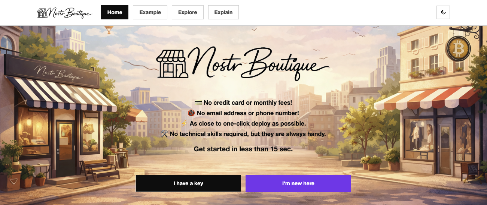

# Nostr Boutique



`nostr.boutique` is a landing site for sovereign Nsite storefronts built around the Gamma market flow and Nostr identity.

It explains the model, shows a live example, explores related Nsites, and lets visitors clone the source Nsite either with an existing Nostr signer or by generating a fresh identity.

## What This Site Does

- Presents a simple homepage CTA for two paths:
  - `I have a key`
  - `I'm new here`
- Clones the source Nsite rooted at:
  - `npub1equrmqway3qxw3dkssymusxkwgwrqypfgeqx0lx9pgjam7gnj4ysaqhkj6`
- Shows a live example through `nsite.run` and `nsite.lol`
- Explains Nostr, Nsites, and gateways for newcomers
- Discovers related template clones from relay manifests

## Pages

- `/` - home hero, clone flow, and how-it-works section
- `/example` - live Nsite preview switcher for both gateways
- `/explore` - heuristic discovery of related cloned Nsites
- `/explain` - beginner-friendly explanation of the stack

## Clone Flow

The homepage includes both clone paths:

- **Existing Nostr users**
  - use a NIP-07 signer extension to publish a cloned root manifest
- **New users**
  - generate a keypair locally
  - back up `npub` and `nsec`
  - publish a profile and cloned root manifest

The clone logic is adapted from the Gamma-Napp workflow and publishes root Nsite manifests with `muse` attribution.

## Stack

- Nuxt
- Vue 3
- Tailwind CSS
- Pinia
- Vite
- JavaScript
- nostr-tools

## Development

```bash
npm install
npm run dev
```

## Production Build

```bash
npm run generate
```

Preview the generated static site:

```bash
npx serve .output/public
```

## Project Structure

```text
Nostr-Boutique/
├── assets/
├── components/
├── composables/
├── layouts/
├── pages/
├── public/
├── stores/
├── App.vue
├── nuxt.config.js
└── README.md
```

## Notes

- Light mode is the default
- The hero uses separate light/dark background images
- The Explore page enriches discovered Nsites with kind `0` profile data when available

## License

GNU GENERAL PUBLIC LICENSE v3
